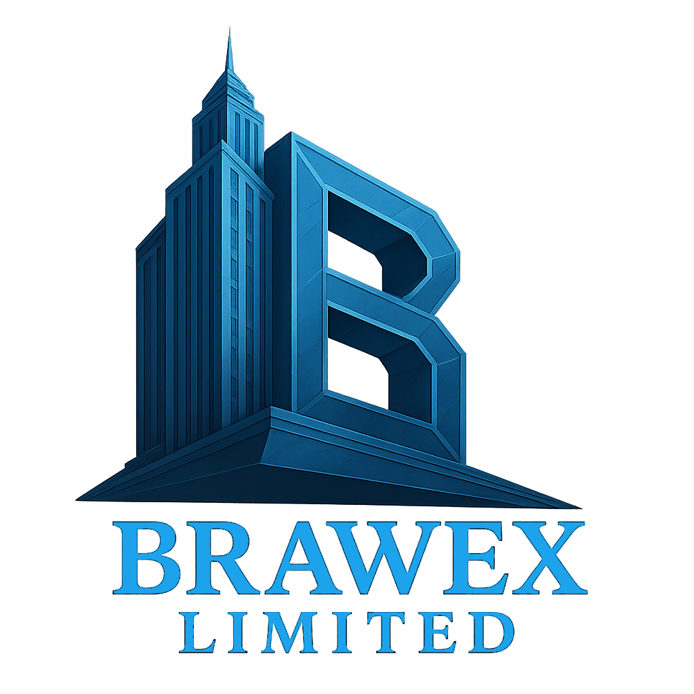

# Brawex Limited - Official Website



**Professional construction and building services website for Brawex Limited, a UK-based construction company specialising in commercial and domestic building projects.**

## 🏢 About Brawex Limited

**Company Number:** 16456830  
**Incorporated:** 19 May 2025  
**Address:** 61 Woodstock Crescent, London, N9 7NB, England  
**Status:** Active  

Brawex Limited is a dynamic construction company founded in May 2025, specialising in commercial and domestic building projects. We deliver high-quality construction services and installation solutions across London and surrounding areas.

### Business Activities (SIC Codes)
- **41201** - Construction of commercial buildings
- **41202** - Construction of domestic buildings  
- **43290** - Other construction installation
- **43999** - Other specialised construction activities

## 🚀 Website Features

- **🎨 Modern Glassmorphism Design** - Beautiful frosted glass effects throughout
- **🌓 Dark/Light Mode Toggle** - Seamless theme switching with localStorage persistence
- **📱 Fully Responsive** - Optimized for all devices and screen sizes
- **⚡ Fast Performance** - Built with Vite for lightning-fast development and builds
- **🎭 Smooth Animations** - Framer Motion powered micro-interactions
- **🔍 SEO Optimized** - Comprehensive meta tags and semantic HTML
- **♿ Accessibility** - WCAG compliant with proper ARIA labels
- **📊 Management Team** - Detailed director profiles and company information
- **📸 Image Slider** - Dynamic content showcase with auto-play
- **📞 Contact Integration** - Direct email and social media links

## 🛠️ Technology Stack

### Core Technologies
- **React 18** - Modern UI library with hooks
- **Vite** - Next-generation frontend tooling
- **TailwindCSS 3.x** - Utility-first CSS framework
- **PostCSS & Autoprefixer** - CSS processing

### UI & Animations
- **Framer Motion** - Production-ready motion library
- **Lucide React** - Beautiful icon library
- **React Icons** - Popular icon libraries collection

### Development Tools
- **ESLint** - Code linting and formatting
- **React Hook Form & Yup** - Form handling and validation
- **React Scroll** - Smooth scrolling navigation

## 🏃‍♂️ Quick Start

### Prerequisites
- Node.js 16.x or higher
- npm or yarn package manager

### Installation

```bash
# Clone the repository
git clone <repository-url>
cd brawex-limited

# Install dependencies
npm install

# Start development server
npm run dev

# Build for production
npm run build

# Preview production build
npm run preview
```

### Available Scripts

```bash
npm run dev      # Start development server at http://localhost:5173
npm run build    # Build for production
npm run preview  # Preview production build
npm run lint     # Run ESLint
```

## 📁 Project Structure

```
brawex-limited/
├── public/
│   ├── img/
│   │   ├── full-icon.png     # Company logo
│   │   ├── favicon.png       # Site favicon
│   │   └── apple-touch-icon.png
│   └── index.html
├── src/
│   ├── components/
│   │   ├── Navbar.jsx        # Navigation component
│   │   ├── Footer.jsx        # Footer with company info
│   │   ├── ManagementTeam.jsx # Director profiles
│   │   ├── ImageSlider.jsx   # Hero image carousel
│   │   ├── ThemeToggle.jsx   # Dark/light mode toggle
│   │   └── ScrollToTop.jsx   # Scroll to top button
│   ├── config/
│   │   └── theme.jsx         # Theme context provider
│   ├── App.jsx               # Main application component
│   ├── main.jsx             # Application entry point
│   └── index.css            # Global styles and Tailwind imports
├── tailwind.config.js       # Tailwind configuration
├── postcss.config.js        # PostCSS configuration
├── vite.config.js          # Vite configuration
└── package.json            # Dependencies and scripts
```

## 🎨 Design System

### Color Palette
- **Primary:** Brawex Blue (#2bb8ff)
- **Light Mode:** Soft neutral grays and whites
- **Dark Mode:** Deep slates and blues
- **Accent:** Gradient combinations

### Typography
- **Primary Font:** Inter
- **Display Font:** Inter Display
- **Icons:** Lucide React, React Icons

### Components
- **Glassmorphism Effects** - Frosted glass cards and backgrounds
- **Smooth Animations** - Framer Motion powered interactions
- **Responsive Grid** - Mobile-first design approach

## 👥 Management Team

### Founding Directors
- **Mutluer Bali** - Director & Co-Founder (British)
- **Sinan Girgin** - Director & Co-Founder (Turkish)

Both directors bring extensive experience in construction management and technical operations, ensuring comprehensive project delivery from inception to completion.

## 🌐 Deployment

The website is optimized for deployment on modern hosting platforms:

### Recommended Platforms
- **Vercel** - Zero-configuration deployment
- **Netlify** - Continuous deployment from Git
- **GitHub Pages** - Free hosting for static sites

### Build Optimization
- Automatic code splitting
- CSS purging for minimal bundle size
- Image optimization
- Progressive Web App features

## 📞 Contact Information

**Email:** info@brawex.co.uk  
**Phone:** +44 20 8XXX XXXX  
**Address:** 61 Woodstock Crescent, London, N9 7NB, England  
**Company Number:** 16456830

### Social Media
- LinkedIn
- Facebook  
- Instagram
- X (Twitter)

## 🤝 Contributing

This is a private commercial website for Brawex Limited. For business inquiries or technical support, please contact us through the official channels listed above.

## 📄 License

© 2024 Brawex Limited. All rights reserved.

**Company Registration:** Private Limited Company incorporated in England and Wales  
**Registered Office:** 61 Woodstock Crescent, London, N9 7NB, England

---

**Building excellence since 2025** 🏗️✨
